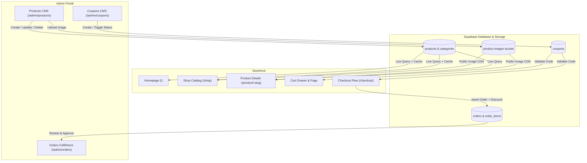

# Implementation Plan: Backend Integration

Transform the storefront into a 100% dynamic, database-driven e-commerce platform connected to your Supabase backend. This replaces static mock data with real-time Supabase database records, adds direct image uploads to Supabase Storage, and implements a full coupon/promo-code discount system for both customers and admins.

---

## User Review Required

> [!IMPORTANT]
> **What This Accomplishes**:
>
> 1. **Live Catalog Sync**: Any product added, edited, or deleted in the Admin Dashboard (`/admin/products`) will immediately reflect across the customer storefront (`/`, `/shop`, `/product/:slug`), with zero code changes or rebuilds.
> 2. **Real Photo Uploads**: Admins can drag and drop product photos directly from their computer or phone into Supabase Storage instead of typing image URLs.
> 3. **Promo Codes & Discounts**: Customers can enter discount codes (e.g. `AURA10`, `FESTIVE500`) at checkout to receive instant discounts, and Admins can create and manage coupons from a dedicated Admin CMS.
> 4. **Resilient Fallback Guarantee**: If the Supabase database is empty or still initializing, the app gracefully falls back to the bundled catalog, ensuring the storefront never renders blank or crashes.

---

## Architecture & Data Flow

---

## Detailed Implementation Phases

### Phase 1: Database Migrations & Coupon Schema

- **Subphase 1.1: Migration for Coupons & Storage Bucket Permissions**
  - Author [`supabase/migrations/03_coupons_and_storage.sql`](file:///d:/Adore%20%20Aura/supabase/migrations/03_coupons_and_storage.sql):
    - Create `public.coupons` table:
      - `id UUID PRIMARY KEY DEFAULT uuid_generate_v4()`
      - `code TEXT UNIQUE NOT NULL` (e.g. `AURA10`, `FESTIVE500`)
      - `discount_type TEXT NOT NULL CHECK (discount_type IN ('percentage', 'fixed'))`
      - `discount_value NUMERIC(10, 2) NOT NULL`
      - `min_order_amount NUMERIC(10, 2) DEFAULT 0`
      - `max_discount_amount NUMERIC(10, 2)` (cap for percentage discounts)
      - `valid_from TIMESTAMP WITH TIME ZONE DEFAULT timezone('utc'::text, now())`
      - `valid_until TIMESTAMP WITH TIME ZONE`
      - `usage_limit INTEGER`
      - `times_used INTEGER DEFAULT 0`
      - `is_active BOOLEAN DEFAULT true`
    - Add `applied_coupon_code TEXT` to `public.orders`.
    - Setup Row-Level Security (RLS):
      - Anyone can validate active coupons.
      - Authenticated admins have full CRUD permissions.
  - Update [`supabase/schema.sql`](file:///d:/Adore%20%20Aura/supabase/schema.sql) with the complete unified schema.

- **Subphase 1.2: Seed Launch Coupons**
  - Seed 3 default festive coupons into the migration:
    - `AURA10`: 10% off entire order.
    - `FESTIVE500`: Flat ₹500 off on orders above ₹2,499.
    - `WELCOME100`: Flat ₹100 off on orders above ₹799.

---

### Phase 2: Dynamic Supabase Catalog Engine

- **Subphase 2.1: Data Normalization Layer ([`src/lib/products.ts`](file:///d:/Adore%20%20Aura/src/lib/products.ts))**
  - Create a normalizer that maps Supabase snake_case columns to the application's camelCase interfaces:
    - `category_slug` → `category`
    - `compare_at` → `compareAt`
    - `image_url` → `image`
    - `reviews_count` → `reviews`
  - Maintain the bundled static catalog as an automatic fallback if network or database table is unseeded.

- **Subphase 2.2: TanStack React Query Hooks (`src/hooks/use-products.ts`)**
  - Implement caching, deduplication, and stale-time controls using `@tanstack/react-query`:
    - `useLiveProducts(options)`: Fetches published products with optional category, search filter, and sorting.
    - `useLiveCategories()`: Fetches categories from Supabase.
    - `useLiveProduct(slug)`: Fetches a single product by slug with fallback.
    - Cache invalidation helper `invalidateProductCatalog()` to instantly refresh customer screens when admin creates or edits products.

- **Subphase 2.3: Storefront Pages Integration**
  - Update [`src/routes/index.tsx`](file:///d:/Adore%20%20Aura/src/routes/index.tsx): Display live featured products and category counts.
  - Update [`src/routes/shop.index.tsx`](file:///d:/Adore%20%20Aura/src/routes/shop.index.tsx): Wire search, category filtering, and sorting to live Supabase data.
  - Update [`src/routes/shop.$category.tsx`](file:///d:/Adore%20%20Aura/src/routes/shop.$category.tsx): Filter products dynamically by category slug.
  - Update [`src/routes/product.$slug.tsx`](file:///d:/Adore%20%20Aura/src/routes/product.$slug.tsx): Render live product specifications, pricing, stock alerts, and related recommendations.

---

### Phase 3: Supabase Storage Image Upload Pipeline

- **Subphase 3.1: Image Upload Service (`src/lib/storage.ts`)**
  - File validation: Supports JPEG, PNG, WEBP, and AVIF up to 5MB.
  - Unique file naming with timestamp and sanitized slug.
  - Uploads to `product-images` bucket via `supabase.storage.from("product-images").upload(...)`.
  - Returns direct CDN public URL via `getPublicUrl()`.

- **Subphase 3.2: Image Upload UI in Admin CMS ([`src/routes/admin.products.tsx`](file:///d:/Adore%20%20Aura/src/routes/admin.products.tsx))**
  - In Add Product and Edit Product modals:
    - Add drag-and-drop file upload zone alongside manual URL input.
    - Live upload progress indicator and image preview thumbnail.
    - Automatic population of the `image_url` payload field upon upload completion.

---

### Phase 4: Coupon & Promo-Code System

- **Subphase 4.1: Coupon Validation Service (`src/lib/coupons.ts`)**
  - Validate code existence, active status, date expiry, and minimum order threshold.
  - Calculate exact discount deduction (percentage with optional cap or flat amount).
  - Return informative error messages (e.g. _"Order total must be at least ₹2,499 to apply FESTIVE500"_).

- **Subphase 4.2: Customer Checkout & Cart Integration ([`src/routes/checkout.tsx`](file:///d:/Adore%20%20Aura/src/routes/checkout.tsx))**
  - Add Coupon Code input box in the Order Summary panel with an **"Apply"** button.
  - Show green badge with applied discount: _"AURA10 applied: -₹150"_ and a **"Remove"** button.
  - Recalculate subtotal, discount, and final amount payable.
  - Store `applied_coupon_code` and `discount_total` in Supabase `orders` on placement.

- **Subphase 4.3: Admin Coupons Management CMS (`src/routes/admin.coupons.tsx`)**
  - Add `/admin/coupons` route and sidebar navigation link in [`src/routes/admin.tsx`](file:///d:/Adore%20%20Aura/src/routes/admin.tsx).
  - Features:
    - Active coupons board with code, type, discount, min order, times used, and active status.
    - "Add New Coupon" modal with code, discount type, value, expiry date, and usage limit.
    - One-click active/inactive toggle and delete confirmation.

---

### Phase 5: Verification & End-to-End Validation

- **Subphase 5.1: Compilation & Lint Checks**
  - Run `npx tsc --noEmit`, `npm run lint`, and `npm run format`.
  - Run `npx vite build` to ensure both client and SSR bundles build with 0 errors.
- **Subphase 5.2: End-to-End Testing Flow**
  1. Add a test product with a real photo upload in `/admin/products`.
  2. Verify it appears immediately on `/shop` and `/product/:slug`.
  3. Create a coupon in `/admin/coupons`.
  4. Apply the coupon at `/checkout`, confirm discount applies, and place order via UPI.
  5. Check `/admin/orders` to verify order details, discount deduction, and UTR.

---

## File Modification Plan

- `[NEW]` [`supabase/migrations/03_coupons_and_storage.sql`](file:///d:/Adore%20%20Aura/supabase/migrations/03_coupons_and_storage.sql)
- `[MODIFY]` [`supabase/schema.sql`](file:///d:/Adore%20%20Aura/supabase/schema.sql)
- `[MODIFY]` [`src/lib/products.ts`](file:///d:/Adore%20%20Aura/src/lib/products.ts)
- `[NEW]` [`src/hooks/use-products.ts`](file:///d:/Adore%20%20Aura/src/hooks/use-products.ts)
- `[NEW]` [`src/lib/storage.ts`](file:///d:/Adore%20%20Aura/src/lib/storage.ts)
- `[NEW]` [`src/lib/coupons.ts`](file:///d:/Adore%20%20Aura/src/lib/coupons.ts)
- `[MODIFY]` [`src/routes/index.tsx`](file:///d:/Adore%20%20Aura/src/routes/index.tsx)
- `[MODIFY]` [`src/routes/shop.index.tsx`](file:///d:/Adore%20%20Aura/src/routes/shop.index.tsx)
- `[MODIFY]` [`src/routes/shop.$category.tsx`](file:///d:/Adore%20%20Aura/src/routes/shop.$category.tsx)
- `[MODIFY]` [`src/routes/product.$slug.tsx`](file:///d:/Adore%20%20Aura/src/routes/product.$slug.tsx)
- `[MODIFY]` [`src/routes/checkout.tsx`](file:///d:/Adore%20%20Aura/src/routes/checkout.tsx)
- `[MODIFY]` [`src/routes/admin.products.tsx`](file:///d:/Adore%20%20Aura/src/routes/admin.products.tsx)
- `[NEW]` [`src/routes/admin.coupons.tsx`](file:///d:/Adore%20%20Aura/src/routes/admin.coupons.tsx)
- `[MODIFY]` [`src/routes/admin.tsx`](file:///d:/Adore%20%20Aura/src/routes/admin.tsx)
- `[MODIFY]` [`PROJECT_STATUS.md`](file:///d:/Adore%20%20Aura/PROJECT_STATUS.md)
