# Implementation Plan: Shipping, Content & Marketing

Transform the Adore & Aura storefront from a functional e-commerce site into a fully operational business with real shipping integrations, rich content for SEO and brand building, and marketing automation for growth.

---

## User Review Required

> [!IMPORTANT]
> **What This Accomplishes**:
>
> 1. **Real Shipping Operations**: Pincode serviceability checks at checkout, Shiprocket-powered label generation & tracking, and automated shipping status updates via WhatsApp.
> 2. **Content-Driven SEO & Brand**: A blog/journal system for festival stories and gifting guides, customer testimonials for social proof, and an Instagram feed for visual brand building.
> 3. **Growth Marketing Engine**: Google Analytics 4 + Meta Pixel for attribution, automated abandoned cart recovery via WhatsApp, wishlist share links for viral loops, and a gift card system for new revenue.

---

## Architecture & Data Flow

```mermaid
graph TD
    subgraph Supabase Database
        DB_Products[(products)]
        DB_Orders[(orders)]
        DB_Blog[(posts)]
        DB_Testimonials[(testimonials)]
        DB_GiftCards[(gift_cards)]
        DB_CartEvents[(cart_events)]
    end

    subgraph Storefront
        Home["Homepage"]
        Shop["Shop"]
        Checkout["Checkout"]
        BlogPage["Blog (/blog)"]
        PostPage["Blog Post (/blog/:slug)"]
        Track["Track Order (/track)"]
        GiftCardPage["Gift Cards"]
        WishlistPage["Wishlist"]
    end

    subgraph Admin Portal
        AdminBlog["Blog CMS"]
        AdminTestimonials["Testimonials CMS"]
        AdminGiftCards["Gift Cards CMS"]
        AdminShipping["Shipping Settings"]
        AdminOrders["Orders Board"]
    end

    subgraph External Services
        Shiprocket["Shiprocket API"]
        GA4["Google Analytics 4"]
        Meta["Meta Pixel"]
        WhatsApp["WhatsApp API"]
    end

    DB_Products --> Home
    DB_Products --> Shop
    Checkout --> DB_Orders
    DB_Orders --> Track
    DB_Orders --> Shiprocket
    DB_Blog --> BlogPage
    DB_Blog --> PostPage
    DB_Testimonials --> Home
    DB_GiftCards --> GiftCardPage
    DB_CartEvents --> WhatsApp

    AdminBlog --> DB_Blog
    AdminTestimonials --> DB_Testimonials
    AdminGiftCards --> DB_GiftCards
    AdminShipping --> DB_Orders
    AdminOrders --> Shiprocket

    Checkout --> GA4
    Checkout --> Meta
    DB_CartEvents --> Meta
```



---

## Detailed Implementation Phases

### Phase 1: Shipping — Pincode Serviceability & Rate Calculator

> **Why first**: Every checkout currently shows "Free ship ₹999+" as a static message. Customers in remote areas may order and then discover shipping is unavailable or expensive. A pincode checker prevents failed deliveries and builds trust.

#### Subphase 1.1: Shipping Configuration Table & API

- **Create** `supabase/migrations/04_shipping_config.sql`:
  - Create `public.shipping_rules` table:
    - `id UUID PRIMARY KEY DEFAULT uuid_generate_v4()`
    - `pincode_prefix TEXT NOT NULL` (first 3 digits — covers entire serviceable zones)
    - `zone TEXT NOT NULL` (e.g. `'metro'`, `'tier1'`, `'tier2'`, `'remote'`)
    - `shipping_fee NUMERIC(10, 2) NOT NULL DEFAULT 0`
    - `free_shipping_min NUMERIC(10, 2) DEFAULT 999`
    - `cod_available BOOLEAN DEFAULT true`
    - `estimated_days_min INTEGER DEFAULT 3`
    - `estimated_days_max INTEGER DEFAULT 7`
    - `is_serviceable BOOLEAN DEFAULT true`
    - `created_at TIMESTAMP WITH TIME ZONE DEFAULT timezone('utc'::text, now())`
  - Add composite index on `pincode_prefix`
  - RLS: anyone can read serviceable pincodes, admins have full CRUD
  - Seed default rules for major metros (110, 400, 560, 600, 700, 500, 122, etc.)

- **Create** `src/lib/shipping.ts` — Shipping Rate Calculator:
  - `ShippingRule` interface matching the DB schema
  - `fetchShippingRule(pincode: string)` — queries `shipping_rules` by 3-digit prefix
  - `calculateShipping(pincode: string, subtotal: number)` — returns `{ fee, estimatedDays, codAvailable, isServiceable, freeShipping }`
  - Fallback: if no rule matches, default to ₹99 shipping, 5–7 day delivery, COD available
  - Export `INR` formatting helper already exists in `products.ts`

#### Subphase 1.2: Pincode Checker UI in Checkout

- **Modify** `src/routes/checkout.tsx`:
  - After the shipping address form (Step 2), add a "Check Delivery" inline component:
    - 6-digit pincode input with "Check" button
    - On check: calls `calculateShipping()`, displays result below:
      - ✅ "Delivery available — ₹{fee} (Free above ₹{min}) · Est. {days} days"
      - ❌ "Sorry, we don't deliver to this pincode yet"
      - ✅/❌ COD availability indicator
    - If free shipping threshold not met, show "Add ₹{remaining} more for free shipping"
  - Auto-trigger check when pincode field in shipping form is filled (debounced)
  - Store `shipping_fee` and `estimated_days` in a local state, pass to order insert payload

#### Subphase 1.3: Shipping Display on Product & Cart Pages

- **Modify** `src/components/site/product-card.tsx`:
  - Add a small "Free Shipping" badge below the price when product price ≥ ₹999

- **Modify** `src/routes/cart.tsx`:
  - Add pincode input in cart page with "Check delivery" to show estimated delivery date before proceeding to checkout
  - Show shipping cost estimate in cart summary

---

### Phase 2: Shipping — Shiprocket Integration for Fulfillment

> **Why next**: Once pincode serviceability works, orders need real shipping labels, tracking numbers, and courier assignment. Shiprocket is the most popular aggregator in India, supporting 17+ carriers.

#### Subphase 2.1: Shiprocket API Service

- **Create** `src/lib/shiprocket.ts` — Shiprocket API Client:
  - `ShiprocketConfig` type: `{ email, password, baseUrl }` from env vars
  - `getShiprocketToken()` — authenticates and caches JWT token (24hr expiry)
  - `createShiprocketOrder(orderData)` — creates order on Shiprocket:
    - Maps Supabase order → Shiprocket payload (billing/shipping address, items, COD amount)
    - Returns `shipment_id` and `tracking_number`
  - `generateShippingLabel(shipmentId)` — generates courier label PDF
  - `trackShipment(awbNumber)` — fetches live tracking status from Shiprocket
  - `cancelShipment(shipmentId)` — cancels shipment if needed
  - Error handling with toast notifications

- **Modify** `supabase/migrations/04_shipping_config.sql` (append):
  - Add columns to `orders` table:
    - `shipment_id TEXT` (Shiprocket shipment ID)
    - `awb_number TEXT` (Air Waybill / tracking number)
    - `courier_name TEXT`
    - `estimated_delivery DATE`
    - `shipped_at TIMESTAMP WITH TIME ZONE`
    - `delivered_at TIMESTAMP WITH TIME ZONE`
  - Update `supabase/schema.sql` with these columns

#### Subphase 2.2: Admin Shipping Controls

- **Modify** `src/routes/admin.orders.tsx`:
  - Add "Ship Order" button next to CONFIRMED orders:
    - On click: calls `createShiprocketOrder()`, updates order with `shipment_id`, `awb_number`, `courier_name`
    - Shows generated tracking number and estimated delivery
  - Add "Generate Label" button for shipped orders (downloads label PDF)
  - Add tracking status display: live status from `trackShipment()` with timeline view
  - Add estimated delivery date column in orders table

- **Create** `src/routes/admin.shipping.tsx` — Shipping Rules Management:
  - Table view of all shipping rules (pincode prefix, zone, fee, free min, COD, estimated days, serviceable)
  - Add/Edit/Delete rules with modal forms
  - Bulk toggle serviceable/not-serviceable for zones
  - Link from admin sidebar

#### Subphase 2.3: Order Tracking Page for Customers

- **Create** `src/routes/track.tsx` — `/track` public route:
  - Input field: "Enter your Order ID or Tracking Number"
  - On submit: queries `orders` table by ID or `awb_number`
  - Displays:
    - Order status timeline (PENDING → CONFIRMED → PACKED → SHIPPED → DELIVERED)
    - Tracking number and courier name with link to carrier tracking page
    - Estimated delivery date
    - Order items summary
  - WhatsApp support button for issues

- **Modify** `src/routes/account.tsx`:
  - Add "Track" button next to shipped orders that links to `/track?order={id}`
  - Show estimated delivery date on order cards

---

### Phase 3: Content — Blog / Journal System

> **Why now**: A blog is the single highest-ROI content investment for SEO. Festival guides, gifting stories, and behind-the-scenes content drive organic traffic and build brand authority.

#### Subphase 3.1: Blog Database Schema

- **Create** `supabase/migrations/05_blog_and_content.sql`:
  - Create `public.posts` table:
    - `id UUID PRIMARY KEY DEFAULT uuid_generate_v4()`
    - `slug TEXT UNIQUE NOT NULL`
    - `title TEXT NOT NULL`
    - `excerpt TEXT`
    - `content TEXT NOT NULL` (rich text / markdown)
    - `cover_image_url TEXT`
    - `author_name TEXT DEFAULT 'Adore & Aura'`
    - `category TEXT` (e.g. `'festival'`, `'gifting'`, `'craft'`, `'behind-the-scenes'`)
    - `tags TEXT[] DEFAULT '{}'`
    - `is_published BOOLEAN DEFAULT false`
    - `published_at TIMESTAMP WITH TIME ZONE`
    - `created_at TIMESTAMP WITH TIME ZONE DEFAULT timezone('utc'::text, now())`
    - `updated_at TIMESTAMP WITH TIME ZONE DEFAULT timezone('utc'::text, now())`
  - RLS: public can read published posts, admins have full CRUD
  - Seed 3 starter posts:
    - "The Art of Rakhi: A Guide to Choosing the Perfect Rakhi" (festival)
    - "5 Ways to Make Raksha Bandhan Special This Year" (festival)
    - "Behind the Scenes: How Our AD Rakhis Are Hand-Crafted" (craft)

#### Subphase 3.2: Blog CMS in Admin

- **Create** `src/routes/admin.blog.tsx` — Blog CMS:
  - Table view of all posts: title, category, status (Published/Draft), published date, actions
  - "Add New Post" modal:
    - Title, slug (auto-generated), excerpt, content (textarea with markdown support hint)
    - Cover image upload (reuse `ImageUpload` component from `admin.products.tsx`)
    - Category select, tags input (comma separated)
    - Publish / Save as Draft toggle
  - Edit post modal (same fields)
  - Delete with confirmation
  - One-click publish/unpublish toggle

- **Modify** `src/routes/admin.tsx`:
  - Add "Blog" link with `FileText` icon to sidebar nav

#### Subphase 3.3: Public Blog Pages

- **Create** `src/routes/blog.index.tsx` — `/blog` listing page:
  - Hero section: "The Journal" with brand tagline
  - Category filter pills (All, Festival, Gifting, Craft, Behind the Scenes)
  - Post cards in a responsive grid: cover image, title, excerpt, category badge, published date
  - Search input for post title/content
  - Pagination (10 posts per page)

- **Create** `src/routes/blog.$slug.tsx` — `/blog/:slug` post page:
  - Full post view: cover image, title, author, date, category badge
  - Rich content rendering (markdown → HTML or plain text with proper typography)
  - Tags display
  - "You may also like" — related posts from same category
  - Social share buttons (WhatsApp, Twitter, Facebook)
  - Newsletter CTA at bottom

- **Modify** `src/components/site/footer.tsx`:
  - Add "Journal" link in Help section pointing to `/blog`

- **Modify** `src/routes/index.tsx`:
  - Add a "From the Journal" section after the Story section, showing latest 3 blog posts

---

### Phase 4: Content — Testimonials & Instagram Feed

> **Why**: Social proof (testimonials) and visual brand building (Instagram) are proven conversion drivers. They reduce purchase anxiety and make the brand feel alive.

#### Subphase 4.1: Testimonials System

- **Add to** `supabase/migrations/05_blog_and_content.sql`:
  - Create `public.testimonials` table:
    - `id UUID PRIMARY KEY DEFAULT uuid_generate_v4()`
    - `customer_name TEXT NOT NULL`
    - `location TEXT`
    - `rating INTEGER NOT NULL CHECK (rating >= 1 AND rating <= 5)`
    - `review_text TEXT NOT NULL`
    - `product_slug TEXT` (optional link to a product)
    - `is_featured BOOLEAN DEFAULT false`
    - `is_approved BOOLEAN DEFAULT false`
    - `created_at TIMESTAMP WITH TIME ZONE DEFAULT timezone('utc'::text, now())`
  - RLS: public can read approved testimonials, admins have full CRUD
  - Seed 5 sample testimonials with festive themes

- **Create** `src/routes/admin.testimonials.tsx` — Testimonials CMS:
  - Table: customer name, location, rating (stars), review preview, featured toggle, approved toggle
  - Approve/reject toggle for customer reviews
  - Feature/unfeature toggle for homepage display
  - Delete with confirmation

- **Modify** `src/routes/admin.tsx`:
  - Add "Reviews" link with `Star` icon to sidebar nav

#### Subphase 4.2: Testimonials on Storefront

- **Modify** `src/routes/index.tsx`:
  - Add "What Our Customers Say" section between Featured Products and Story:
    - Carousel of featured testimonials (using existing `embla-carousel-react`)
    - Each card: star rating, review text, customer name + location
    - Auto-advance every 5 seconds

- **Modify** `src/routes/product.$slug.tsx`:
  - Add "Customer Reviews" section below related products:
    - Fetch testimonials linked to this product's slug
    - If none, show "Be the first to review" CTA

#### Subphase 4.3: Instagram Feed Integration

- **Create** `src/lib/instagram.ts` — Instagram Feed Service:
  - Since Instagram Basic API requires approval, use a simple approach:
    - Store Instagram post URLs and image URLs in a Supabase `instagram_posts` table
    - Admin manually curates which posts to show
  - `fetchInstagramPosts(limit)` — returns latest N posts from Supabase

- **Add to** `supabase/migrations/05_blog_and_content.sql`:
  - Create `public.instagram_posts` table:
    - `id UUID PRIMARY KEY DEFAULT uuid_generate_v4()`
    - `image_url TEXT NOT NULL`
    - `post_url TEXT NOT NULL` (link to Instagram post)
    - `caption TEXT`
    - `display_order INTEGER DEFAULT 0`
    - `is_active BOOLEAN DEFAULT true`
    - `created_at TIMESTAMP WITH TIME ZONE DEFAULT timezone('utc'::text, now())`
  - RLS: public can read active posts, admins have full CRUD

- **Create** `src/routes/admin.instagram.tsx` — Instagram Feed CMS:
  - Grid view of curated Instagram posts (image, caption, link, order)
  - Add post: image upload + Instagram URL + caption
  - Drag to reorder display order
  - Toggle active/inactive

- **Modify** `src/routes/index.tsx`:
  - Add "Follow Us @adoreandaura" section after Testimonials:
    - Grid of 4–6 Instagram post thumbnails
    - Each links to the Instagram post in a new tab
    - Hover effect shows caption overlay
    - "Follow on Instagram" CTA button

- **Modify** `src/components/site/footer.tsx`:
  - Update Instagram link from placeholder to actual `@adoreandaura` profile URL

---

### Phase 5: Marketing — Analytics & Pixel Integration

> **Why first in marketing**: You can't improve what you can't measure. GA4 and Meta Pixel must be in place before running any ads or campaigns.

#### Subphase 5.1: Analytics Infrastructure

- **Create** `src/lib/analytics.ts` — Analytics Service:
  - Google Analytics 4 (GA4):
    - Initialize GA4 with measurement ID from env var `VITE_GA4_MEASUREMENT_ID`
    - `trackPageView(url, title)` — page view events
    - `trackViewItemList(items, listName)` — product list views (homepage, category)
    - `selectItem(item, listName)` — product card clicks
    - `viewItem(item)` — product detail page views
    - `addToCart(item, quantity)` — add to cart events
    - `beginCheckout(cart, coupon?)` — checkout initiated
    - `purchase(orderId, items, total, coupon?)` — successful purchase
  - Meta Pixel:
    - Initialize with pixel ID from env var `VITE_META_PIXEL_ID`
    - Mirror GA4 events to Meta: `PageView`, `ViewContent`, `AddToCart`, `InitiateCheckout`, `Purchase`
    - `trackCustomEvent(name, params)` — for custom events like `WishlistAdd`, `CouponApplied`

- **Modify** `src/routes/__root.tsx`:
  - Add GA4 and Meta Pixel script tags in `<head>` (conditionally, only when env vars are set)
  - Add route change tracking via TanStack Router's `useRouterState`

#### Subphase 5.2: Event Tracking in Storefront

- **Modify** `src/routes/index.tsx`:
  - Track `viewItemList` when featured products load
  - Track `selectItem` when product card is clicked

- **Modify** `src/routes/shop.index.tsx` and `shop.$category.tsx`:
  - Track `viewItemList` when product grid loads
  - Track `selectItem` on product card click

- **Modify** `src/routes/product.$slug.tsx`:
  - Track `viewItem` with product details (id, name, price, category)
  - Track `addToCart` when "Add to bag" is clicked

- **Modify** `src/routes/checkout.tsx`:
  - Track `beginCheckout` when Step 3 (Payment) is reached
  - Track `purchase` after successful order placement with transaction ID, items, and total
  - Track `CouponApplied` custom event when a coupon is successfully applied

- **Modify** `src/lib/cart.ts`:
  - Import and call `trackAddToCart` from analytics when `add()` is called

- **Modify** `src/routes/wishlist.tsx`:
  - Track `WishlistAdd` custom event when item is added to wishlist

---

### Phase 6: Marketing — Abandoned Cart Recovery

> **Why**: 70% of online carts are abandoned. Automated recovery via WhatsApp (free, high open rate in India) is the highest-ROI marketing automation for this business.

#### Subphase 6.1: Cart Abandonment Tracking

- **Add to** `supabase/migrations/05_blog_and_content.sql`:
  - Create `public.cart_events` table:
    - `id UUID PRIMARY KEY DEFAULT uuid_generate_v4()`
    - `session_id TEXT NOT NULL` (anonymous identifier from localStorage)
    - `user_id UUID` (nullable — for logged-in users)
    - `event_type TEXT NOT NULL CHECK (event_type IN ('add', 'remove', 'abandoned', 'recovered'))`
    - `product_slug TEXT NOT NULL`
    - `product_title TEXT NOT NULL`
    - `product_price NUMERIC(10, 2) NOT NULL`
    - `product_image TEXT`
    - `quantity INTEGER DEFAULT 1`
    - `contact_phone TEXT` (captured from checkout step 1 if reached)
    - `contact_email TEXT`
    - `abandoned_at TIMESTAMP WITH TIME ZONE`
    - `recovered_at TIMESTAMP WITH TIME ZONE`
    - `created_at TIMESTAMP WITH TIME ZONE DEFAULT timezone('utc'::text, now())`
  - Index on `session_id` and `abandoned_at`
  - RLS: anyone can insert (for anonymous tracking), admins can read all

- **Create** `src/lib/cart-events.ts` — Cart Event Tracker:
  - `getOrCreateSessionId()` — generates or retrieves anonymous session ID from localStorage
  - `trackCartEvent(eventType, product, quantity, contact?)` — inserts into `cart_events`
  - `markCartAbandoned(sessionId)` — marks items as abandoned after 30 minutes of inactivity
  - `markCartRecovered(sessionId)` — marks abandoned cart as recovered after checkout completion
  - Runs a background check on app load: if previous session had items added but no checkout, mark as abandoned

#### Subphase 6.2: WhatsApp Recovery Messages

- **Modify** `src/lib/whatsapp.ts`:
  - `formatCartRecoveryMessage(items, customerName?)` — builds a personalized recovery message:
    ```
    Hi {name}! 🛍️ You left some beautiful pieces in your cart at Adore & Aura:
    • {item1} — ₹{price1}
    • {item2} — ₹{price2}
    Complete your order before it sells out: {link}
    ```
  - `sendCartRecoveryAlert(items, phone)` — sends via CallMeBot API (free tier)

- **Create** `src/lib/cart-recovery.ts` — Recovery Automation:
  - On checkout completion: call `markCartRecovered(sessionId)`
  - On app load: check for abandoned carts (items added > 30 min ago, no checkout)
    - If user phone is available (logged-in or entered in checkout step 1): queue WhatsApp recovery message
    - Rate limit: max 1 recovery message per session per 24 hours

#### Subphase 6.3: Admin Cart Analytics

- **Modify** `src/routes/admin.index.tsx`:
  - Add "Cart Abandonment" card in dashboard:
    - Abandoned carts today / this week
    - Recovery rate (% of abandoned carts that converted)
    - Most abandoned products list
  - Link to detailed cart events table

- **Create** `src/routes/admin.cart-events.tsx` — Cart Events Log:
  - Table of recent cart events: session, product, event type, timestamp
  - Filter by event type (add, abandoned, recovered)
  - Filter by date range
  - Summary stats: total adds, abandonments, recoveries, recovery rate

---

### Phase 7: Marketing — Gift Cards, Referral & Wishlist Share

> **Why last**: These are growth multipliers that build on top of the existing infrastructure. Gift cards create a new revenue stream, referrals drive acquisition, and wishlist shares increase reach.

#### Subphase 7.1: Gift Card System

- **Add to** `supabase/migrations/05_blog_and_content.sql`:
  - Create `public.gift_cards` table:
    - `id UUID PRIMARY KEY DEFAULT uuid_generate_v4()`
    - `code TEXT UNIQUE NOT NULL` (e.g. `GIFT-AURA-XXXX`)
    - `initial_amount NUMERIC(10, 2) NOT NULL`
    - `balance NUMERIC(10, 2) NOT NULL`
    - ` purchaser_name TEXT`
    - `purchaser_email TEXT`
    - `recipient_name TEXT`
    - `recipient_email TEXT`
    - `message TEXT`
    - `is_active BOOLEAN DEFAULT true`
    - `expires_at TIMESTAMP WITH TIME ZONE`
    - `created_at TIMESTAMP WITH TIME ZONE DEFAULT timezone('utc'::text, now())`
  - RLS: admins have full CRUD, public can validate gift card codes

- **Create** `src/lib/gift-cards.ts` — Gift Card Service:
  - `validateGiftCard(code)` — checks validity, balance, expiry
  - `redeemGiftCard(code, amount)` — deducts from balance
  - `createGiftCard(data)` — generates new gift card with unique code

- **Create** `src/routes/gift-cards.tsx` — `/gift-cards` public page:
  - Hero: "Give the Gift of Choice"
  - Amount presets: ₹500, ₹1000, ₹2000, ₹5000, Custom
  - Recipient details: name, email, personal message
  - Purchase form (connects to payment — initially just stores intent, payment later)
  - "Redeem a Gift Card" section: code input, shows balance

- **Modify** `src/routes/checkout.tsx`:
  - Add "Gift Card" as a payment option alongside UPI and COD
  - When selected: code input → validate → show balance → apply to total

- **Modify** `src/routes/admin.tsx`:
  - Add "Gift Cards" link with `CreditCard` icon to sidebar

- **Create** `src/routes/admin.gift-cards.tsx` — Gift Cards CMS:
  - Table: code, amount, balance, purchaser, recipient, status, created date
  - Create gift card modal: amount, recipient details, message
  - Deactivate/activate toggle

#### Subphase 7.2: Wishlist Share Links

- **Modify** `src/lib/wishlist.ts`:
  - `generateShareUrl(slugs)` — creates a URL like `/wishlist/shared?=slugs=peacock-ad-rakhi,kalash-ad-rakhi`
  - `getSharedWishlist(slugs)` — fetches products by slug array

- **Create** `src/routes/wishlist.shared.tsx` — `/wishlist/shared` route:
  - Reads `slugs` from search params
  - Fetches matching products from Supabase
  - Renders a "friend's wishlist" view: product grid with "Buy for them" CTA linking to product page
  - Shows message: "Your friend wants these items for Raksha Bandhan 🎁"

- **Modify** `src/routes/wishlist.tsx`:
  - Add "Share Wishlist" button that copies shareable link to clipboard
  - Show toast: "Link copied! Send it to someone who loves you ✨"

#### Subphase 7.3: Referral System (Basic)

- **Add to** `supabase/migrations/05_blog_and_content.sql`:
  - Add `referral_code TEXT UNIQUE` to `profiles` table (auto-generated on signup)
  - Add `referred_by TEXT` to `orders` table (referral code used at checkout)
  - Create `public.referrals` table:
    - `id UUID PRIMARY KEY DEFAULT uuid_generate_v4()`
    - `referrer_user_id UUID REFERENCES public.profiles(id)`
    - `referred_email TEXT`
    - `status TEXT DEFAULT 'pending' CHECK (status IN ('pending', 'completed', 'rewarded'))`
    - `order_id UUID REFERENCES public.orders(id)`
    - `created_at TIMESTAMP WITH TIME ZONE DEFAULT timezone('utc'::text, now())`

- **Modify** `src/routes/checkout.tsx`:
  - Add optional "Referral Code" input in Contact step (Step 1)
  - If valid code: store `referred_by` in order, show "You'll both get ₹100 off your next order!"

- **Create** `src/routes/account.referrals.tsx` — Referral Dashboard (within `/account`):
  - Show user's unique referral code with copy button
  - "Share via WhatsApp" button with pre-filled message
  - Referral stats: total referrals, completed, pending, rewards earned
  - Referral history table

---

## File Modification Plan

### New Files

- `[NEW]` `supabase/migrations/04_shipping_config.sql`
- `[NEW]` `supabase/migrations/05_blog_and_content.sql`
- `[NEW]` `src/lib/shipping.ts`
- `[NEW]` `src/lib/shiprocket.ts`
- `[NEW]` `src/lib/analytics.ts`
- `[NEW]` `src/lib/cart-events.ts`
- `[NEW]` `src/lib/cart-recovery.ts`
- `[NEW]` `src/lib/gift-cards.ts`
- `[NEW]` `src/lib/instagram.ts`
- `[NEW]` `src/routes/track.tsx`
- `[NEW]` `src/routes/blog.index.tsx`
- `[NEW]` `src/routes/blog.$slug.tsx`
- `[NEW]` `src/routes/gift-cards.tsx`
- `[NEW]` `src/routes/wishlist.shared.tsx`
- `[NEW]` `src/routes/admin.shipping.tsx`
- `[NEW]` `src/routes/admin.blog.tsx`
- `[NEW]` `src/routes/admin.testimonials.tsx`
- `[NEW]` `src/routes/admin.instagram.tsx`
- `[NEW]` `src/routes/admin.gift-cards.tsx`
- `[NEW]` `src/routes/admin.cart-events.tsx`
- `[NEW]` `src/routes/account.referrals.tsx`

### Modified Files

- `[MODIFY]` `supabase/schema.sql` — add shipping, blog, testimonial, gift card, referral tables
- `[MODIFY]` `src/routes/checkout.tsx` — pincode checker, gift card payment, referral code, analytics events
- `[MODIFY]` `src/routes/index.tsx` — testimonials carousel, Instagram feed, blog posts section
- `[MODIFY]` `src/routes/product.$slug.tsx` — customer reviews section, analytics events
- `[MODIFY]` `src/routes/shop.index.tsx` — analytics events
- `[MODIFY]` `src/routes/shop.$category.tsx` — analytics events
- `[MODIFY]` `src/routes/account.tsx` — tracking buttons, referral dashboard link
- `[MODIFY]` `src/routes/wishlist.tsx` — share button, analytics events
- `[MODIFY]` `src/routes/admin.tsx` — sidebar nav updates (Blog, Reviews, Instagram, Gift Cards, Shipping, Cart Events)
- `[MODIFY]` `src/routes/admin.index.tsx` — cart abandonment metrics
- `[MODIFY]` `src/routes/admin.orders.tsx` — ship order button, label generation, tracking
- `[MODIFY]` `src/components/site/header.tsx` — no changes needed
- `[MODIFY]` `src/components/site/footer.tsx` — Journal link, Instagram URL update
- `[MODIFY]` `src/components/site/product-card.tsx` — free shipping badge
- `[MODIFY]` `src/routes/__root.tsx` — GA4 & Meta Pixel scripts
- `[MODIFY]` `src/lib/cart.ts` — analytics event on add
- `[MODIFY]` `src/lib/whatsapp.ts` — cart recovery message formatter
- `[MODIFY]` `src/routes/cart.tsx` — pincode delivery check
- `[MODIFY]` `src/routes/sitemap[.]xml.ts` — include blog posts in sitemap
- `[MODIFY]` `PROJECT_STATUS.md` — update with completed phases
